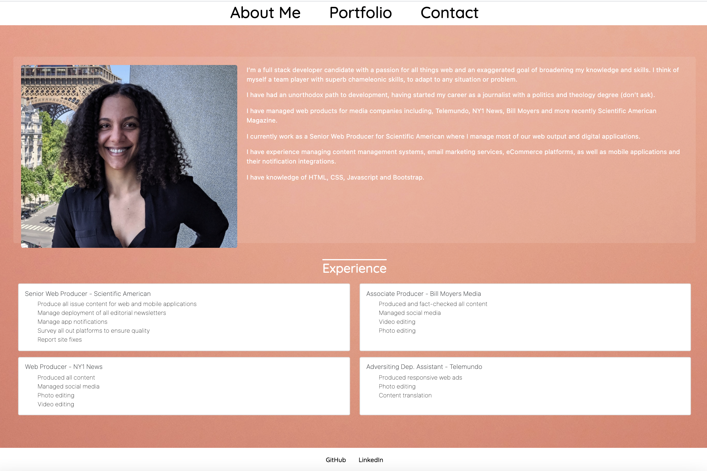
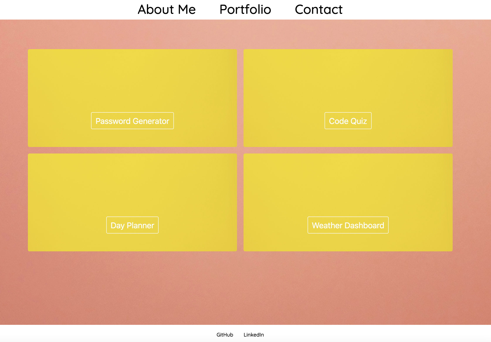

# Portfolio template

This is a portfolio template. The website comprises a landing page with information about the user, a portfolio page with sample project links, and a contact page. Each page has a navigation for easy access to other pages and a footer with links to the user's Github and LinkedIn profiles.

## Styles

The website is styled using Bootstrap v5. Pages are made of one to two columns for the tablet and desktop breakpoints. A single column is used for mobile device breakpoints.

## Pages

### About Me

This page contains a picture of the user, a brief bio, and a listing of professional experience.

### Portfolio

This page currently contains four boxes where ongoing projects will be linked. The projects are expected to be ready in Q1 2021.

### Contact

The contact page includes the user's email address and phone number.

## Contributing

Pull requests are welcome, but should be limited to improving the layout and styles. No changes are allowed to personal information. No special software is required to clone and run the website other than a basic code editor and a browser of choice. 

## TODOs

* Add projects to portfolio page

## License

MIT